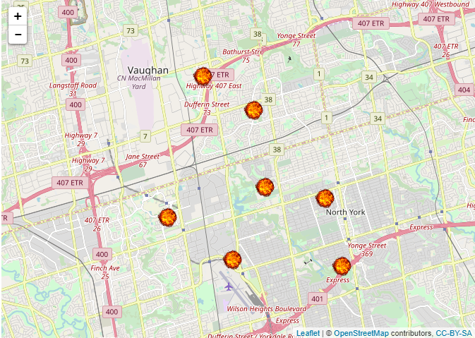

Markdown version of the html file.

# Some Fire Station in Toronto

### July 30, 2017

## Week 2 Developping Data Products

Few fire stations in Toronto, On, Canada.

        library(leaflet)

        lat<- c(43.7763748,
        43.7723877,
        43.8032662,
        43.7506444,
        43.765663,
        43.7485002,
        43.8153226)

        lon <- c(-79.4464261,
        -79.417064,
        -79.451738,
        -79.4619283,
        -79.4936858,
        -79.4089565,
        -79.4765591)

        df<- data.frame(lat=lat, lng=lon)

        fireIcon <- makeIcon(
                iconUrl = "http://www.freepngimg.com/download/fire/2-fire-transparent-png-image.png",
                iconWidth = 30, iconHeight = 31,
                iconAnchorX = 31, iconAnchorY = 30
        )

        df %>% 
                leaflet() %>%
                addTiles() %>%
                addMarkers(icon = fireIcon)

